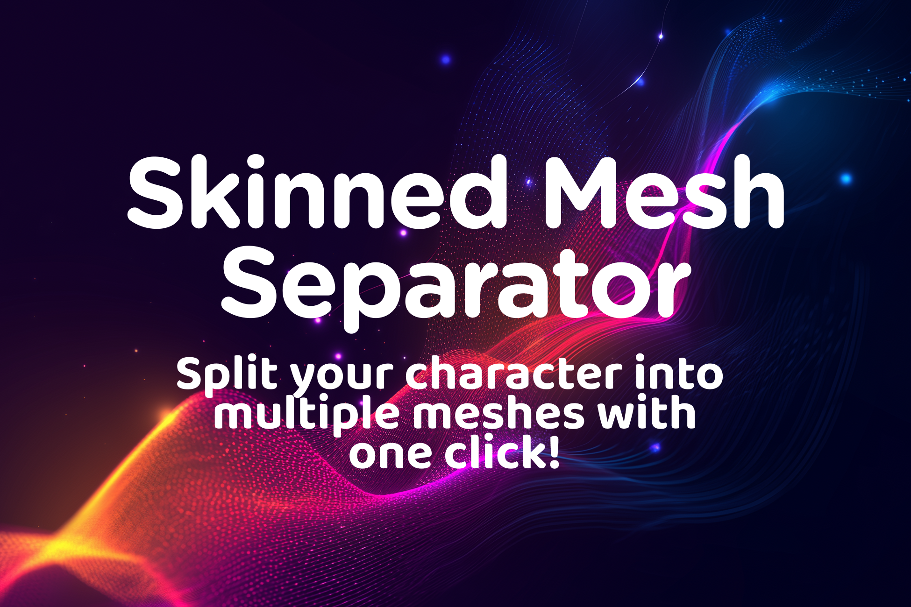

# Skinned Mesh Separator

**Split skinned character meshes by bone — directly in Unity. No external DCC tools required.**

---

Skinned Mesh Separator is a Unity Editor window tool that extracts mesh sections from any `SkinnedMeshRenderer` based on bone influence. Select a bone, click extract, and get a clean new mesh asset saved directly to your project.

Your original character is never modified.

-   :material-lightning-bolt:{ .lg .middle } **Fast Setup**

    ---

    Install via Package Manager and open from `Tools → Skinned Mesh Separator`. No configuration required.

    [:octicons-arrow-right-24: Installation](getting-started/installation.md)

-   :material-bone:{ .lg .middle } **Auto-Find Bones**

    ---

    Automatically detect head and shoulder bones from your rig's bone list with one click.

    [:octicons-arrow-right-24: Tool Overview](usage/tool-overview.md)

-   :material-account-multiple:{ .lg .middle } **Any Rig Type**

    ---

    Works with humanoid, generic, creature, and custom bone hierarchies — any SkinnedMeshRenderer.

    [:octicons-arrow-right-24: Common Workflows](usage/common-workflows.md)

-   :material-shield-check:{ .lg .middle } **Non-Destructive**

    ---

    Extracted meshes save as new assets. The source mesh and character are never touched.

    [:octicons-arrow-right-24: Extracting Meshes](usage/extracting-meshes.md)

---

## Use Cases

| Workflow | Description |
|---|---|
| **Modular Characters** | Isolate body regions to show/hide under armour or clothing layers |
| **First-Person Games** | Generate a headless or armless body mesh aligned to a camera rig |
| **LOD Creation** | Build simplified upper or lower body meshes for performance budgets |
| **Gameplay Effects** | Pre-separate body parts for damage, dismemberment, or prosthetics |
| **Runtime Mesh Switching** | Use extracted meshes as swappable `SkinnedMeshRenderer` components |

---

## Unity Version Compatibility

| Unity Version | Built-in RP | URP | HDRP |
|---|---|---|---|
| 2020.3 LTS and above | ✅ | ✅ | ✅ |
| 2021.x | ✅ | ✅ | ✅ |
| 2022.x | ✅ | ✅ | ✅ |
| 2023.x | ✅ | ✅ | ✅ |
| Unity 6.x | ✅ | ✅ | ✅ |

---

## Support

- :fontawesome-brands-discord: **Discord:** [discord.gg/DSUd2QcyHZ](https://discord.gg/DSUd2QcyHZ)
- :fontawesome-solid-envelope: **Email:** [info@chrisburns.com.au](mailto:info@chrisburns.com.au)
- :fontawesome-solid-store: **Asset Store:** [Leave a rating](https://assetstore.unity.com/packages/tools/utilities/skinned-mesh-separator-346784#reviews)

!!! tip "Enjoying the tool?"
    If Skinned Mesh Separator saved you time, a quick star rating on the Asset Store helps other developers find it — and helps fund future updates. Thank you!
