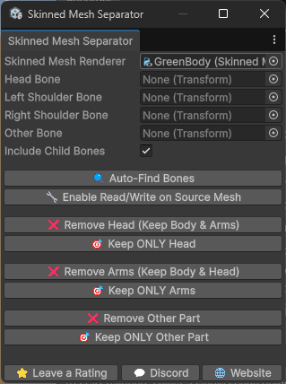

# Tool Overview

Open the tool via **Tools → Skinned Mesh Separator**.

---

## Input Fields

### Skinned Mesh Renderer
Assign the `SkinnedMeshRenderer` component from the character you want to process. This is the only required field.

### Head Bone
The bone that drives the head region of your character (e.g. `Head`, `Bip01_Head`). Used by the **Head** preset buttons.

### Left Shoulder Bone
The bone that drives the left arm (e.g. `Shoulder_L`, `UpperArm_L`). Used by the **Arms** preset buttons.

### Right Shoulder Bone
The bone that drives the right arm (e.g. `Shoulder_R`, `UpperArm_R`). Used by the **Arms** preset buttons.

### Other Bone
An optional field for any additional bone region — a leg, hand, tail, accessory, or any custom part. Used by the **Other Part** preset buttons.

### Include Child Bones
When enabled, any extraction also includes all child bones of the selected bone. This ensures that sub-bones (e.g. jaw, fingers, eyebrows) are captured correctly.

!!! example
    If your head bone has a `Jaw` child bone and `Include Child Bones` is on, the jaw geometry will be included when extracting the head.

---

## Buttons

### 🔍 Auto-Find Bones
Scans the rig's bone list and attempts to automatically assign the Head, Left Shoulder, and Right Shoulder fields based on common naming conventions. Supports variations like:

- `head`, `Head`, `Bip01_Head`
- `leftshoulder`, `Shoulder_L`, `LeftArm`, `UpperArm_L`
- `rightshoulder`, `Shoulder_R`, `RightArm`, `UpperArm_R`

The Console will log how many bones were found (e.g. `Auto-Find Bones: found 3/3`).

### 🔧 Enable Read/Write on Source Mesh
Enables the **Read/Write** flag on the source mesh's import settings in one click. This is required before any extraction. The button triggers a reimport of the asset automatically.

---

## Preset Extraction Buttons

All buttons require the **Skinned Mesh Renderer** to be assigned and the mesh to be readable.

| Button | Bones Required | Output |
|---|---|---|
| Keep ONLY Head | Head Bone | Head geometry only |
| Remove Head (Keep Body & Arms) | Head Bone | Full mesh minus head |
| Keep ONLY Arms | Left + Right Shoulder | Arms geometry only |
| Remove Arms (Keep Body & Head) | Left + Right Shoulder | Full mesh minus arms |
| Keep ONLY Other Part | Other Bone | Custom region only |
| Remove Other Part | Other Bone | Full mesh minus custom region |

---

## Footer Buttons

These appear at the bottom of the tool window:

| Button | Action |
|---|---|
| ⭐ Leave a Rating | Opens the Asset Store review page |
| 💬 Discord | Opens the support Discord server |
| 🌐 Website | Opens chrisburns.com.au |
